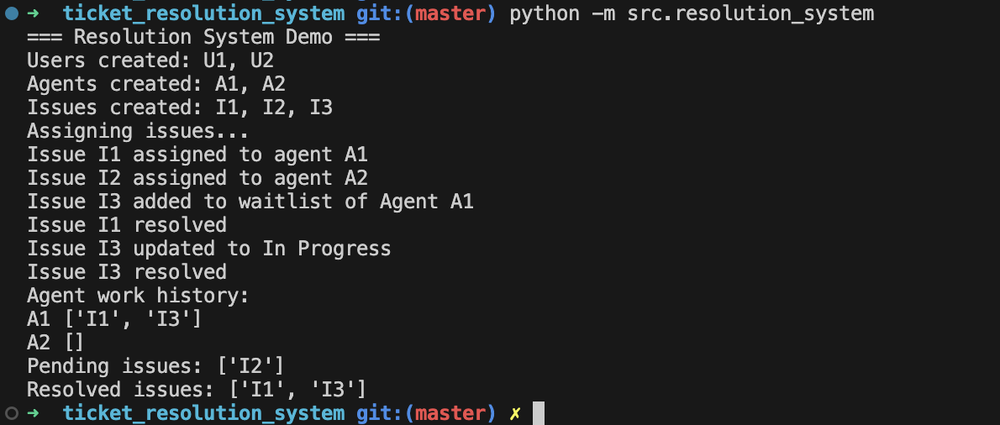

# Ticket Resolution System

## Running the Demo
- Ensure you have Python 3.11+ available.
- From the project root (`/ticket_resolution_system`), run:
  - `PYTHONPATH=. python src/resolution_system.py`
- The script boots an in-memory simulation, printing out each step (user/agent onboarding, issue assignment, waitlisting, updates, resolutions, and history).

## Implementation Strategy
- **Entities** mirror the domain `Issue`, `User`, `Agent`, `Strategy`, and `Transaction` live under `src/data_models`, with enums (`ProductType`, `IssueState`, `StrategyType`) defining shared vocab.


- **Services** encapsulate core actions from the design sketch:
  - `UserService` handles lifecycle and issue bookkeeping for end-users.
  - `IssueService` manages creation, state transitions, and filtered retrieval (`getIssues(filter)`).
  - `AgentService` tracks agent availability, ratings, and exposes `viewAgentsWorkHistory()`.
  - `RoutingStrategyService` owns the pluggable assignment strategies (`FCFS`, `RATING`) and is consulted before each assignment.


- **ResolutionSystem** stitches everything together as the façade requested in the problem statement:
  - Exposes the high-priority functions (`createIssue`, `addAgent`, `assignIssue`, `getIssues`, `updateIssue`, `resolveIssue`, `viewAgentsWorkHistory`).
  - Maintains pending/resolved registries plus agent waitlists so the sample scenario (`assignIssue` → waitlist → auto-reassign) behaves exactly as described.
  - The `main()` routine in `src/resolution_system.py` follows the provided example sequence to validate end-to-end flow.

### Sample Output
```
=== Resolution System Demo ===
Users created: U1, U2
Agents created: A1, A2
Issues created: I1, I2, I3
Assigning issues...
Issue I1 assigned to agent A1
Issue I2 assigned to agent A2
Issue I3 added to waitlist of Agent A1
Issue I1 resolved
Issue I3 updated to In Progress
Issue I3 resolved
Agent work history:
A1 ['I1', 'I3']
A2 []
Pending issues: ['I2']
Resolved issues: ['I1', 'I3']
```




## Rough Design Snapshot
- **Entities**
  - `Issue`: `transactionId`, `issueType`, `subject`, `description`, `state` (`created → pending → closed`), `resolution`, `userId`, `userEmail`, `agentId`
  - `User`: `userId`, `name`, `email`, `activeProducts`, `activeIssues[]`, `createdIssues[]`
  - `Agent`: `agentId`, `name`, `email`, `supportedIssueTypes[]`, `ratings{type: score}`, `resolvedIssueIds[]`, `activeIssueId`, `isOccupied`
  - `Strategy`: `strategyId`, `strategyType`
  - `Transaction`: `transactionId`, `userId`, `productType`

- **Enums**
  - Product types: `gold`, `fd`, `insurance`, `mutual-fund`, …
  - Issue states: `created`, `waiting`, `pending`, `closed`
  - Strategy types: `FCFS`, `RATING`

- **Core Services / Facade**
  - `UserService`: `create_user`, `delete_user`, `get_user_details`, `get_issues`
  - `IssueService`: `create_issue`, `update_issue`, `get_issue`, `mark_waitlisted`
  - `AgentService`: `add_agent`, `update_agent`, `view_agents_work_history`
  - `RoutingStrategyService`: `create_strategy`, `update_strategy`, `assign_agent` (scores agents based on active strategy)
  - `ResolutionSystem`: bootstraps strategies/agents; exposes façade methods `createUser`, `addAgent`, `assignIssue`, `updateIssue`, `resolveIssue`, `viewAgentsWorkHistory`; keeps `pendingIssues`/`resolvedIssues`; auto reassigns from waitlists after resolution.
